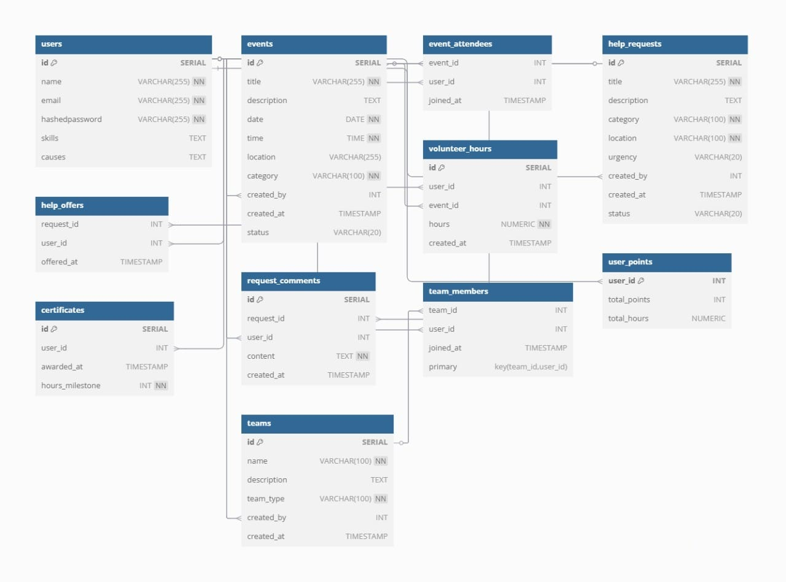

# Warrior

## Project Overview
Warrior is a volunteering platform where users can create accounts, participate in events, and contribute to community help requests. Organizations and individuals can post events or ongoing help requests, create public or private teams, track volunteer hours, and inspire others through leaderboards.

## Technologies Used

### Frontend:
- HTML
- CSS
- Tailwind CSS
- DaisyUI
- React

### Backend:
- Node.js
- Express.js
- PostgreSQL
- JWT
- Bcrypt
- Nodemon

### Packages:
- React Icons
- React Slick Slider

## Features

### Authentication & User Management
- Secure user authentication using JWT and Bcrypt.
- User profile editing.

### Volunteering & Participation
- Users can track their volunteer time.
- Users can log volunteer hours after participation.
- Users can download a certificate after reaching milestones.
- Leaderboard to track top volunteers.

### Event Management
- Users and organizations can create events.
- One-click event participation.
- Event filtering by location.
- View event attendees in one click.

### Community Help Requests
- Users can create help request posts for ongoing support.
- One-click help offer for community requests.
- View list of users helping a request.
- Commenting on community help requests for better clarity.

### Team Collaboration
- Users can create public and private teams.
- Public teams are visible to all users.
- Private teams are visible only to members.
- Only the creator can add members to a private team.

### Miscellaneous
- Fully responsive design for all devices.

### Features Not Implemented
- Private comments or messaging.
- Team dashboards and achievements.

## Frontend Setup Instructions

### Prerequisites
- Node.js installed

### Installation
1. Clone the repository:
   ```bash
   git clone https://github.com/SUPTO-1/hands_on_volunteering_platform.git
   cd hands_on_volunteering_platform
   ```

2. Install dependencies:
   ```bash
   npm install
   ```

3. Start the frontend:
   ```bash
   npm run dev
   ```

## ER Diagram
 

## Database Schema

### Users Table
```sql
CREATE TABLE users(
    id SERIAL PRIMARY KEY,
    name VARCHAR(255) NOT NULL,
    email VARCHAR(255) NOT NULL UNIQUE,
    hashedpassword VARCHAR(255) NOT NULL,
    skills TEXT,
    causes TEXT
);
```

### Events Table
```sql
CREATE TABLE events (
    id SERIAL PRIMARY KEY,
    title VARCHAR(255) NOT NULL,
    description TEXT,
    date DATE NOT NULL,
    time TIME NOT NULL,
    location VARCHAR(255),
    category VARCHAR(100) NOT NULL,
    created_by INT REFERENCES users(id) ON DELETE CASCADE,
    created_at TIMESTAMP DEFAULT NOW(),
    status VARCHAR(20) DEFAULT 'upcoming'
);
```

### Event Attendees Table
```sql
CREATE TABLE event_attendees (
    event_id INT REFERENCES events(id) ON DELETE CASCADE,
    user_id INT REFERENCES users(id) ON DELETE CASCADE,
    joined_at TIMESTAMP DEFAULT NOW()
);
```

### Help Requests Table
```sql
CREATE TABLE help_requests (
    id SERIAL PRIMARY KEY,
    title VARCHAR(255) NOT NULL,
    description TEXT,
    category VARCHAR(100) NOT NULL,
    location VARCHAR(100) NOT NULL,
    urgency VARCHAR(20) CHECK (urgency IN ('low', 'medium', 'urgent')),
    created_by INT REFERENCES users(id) ON DELETE CASCADE,
    created_at TIMESTAMP DEFAULT NOW(),
    status VARCHAR(20) DEFAULT 'open'
);
```

### Help Offers Table
```sql
CREATE TABLE help_offers (
    request_id INT REFERENCES help_requests(id) ON DELETE CASCADE,
    user_id INT REFERENCES users(id) ON DELETE CASCADE,
    offered_at TIMESTAMP DEFAULT NOW()
);
```

### Request Comments Table
```sql
CREATE TABLE request_comments (
    id SERIAL PRIMARY KEY,
    request_id INT REFERENCES help_requests(id) ON DELETE CASCADE,
    user_id INT REFERENCES users(id),
    content TEXT NOT NULL,
    created_at TIMESTAMP DEFAULT NOW()
);
```

### Volunteer Hours Table
```sql
CREATE TABLE volunteer_hours (
    id SERIAL PRIMARY KEY,
    user_id INT REFERENCES users(id) ON DELETE CASCADE,
    event_id INT REFERENCES events(id) ON DELETE CASCADE,
    hours NUMERIC NOT NULL,
    created_at TIMESTAMP DEFAULT NOW()
);
```

### User Points Table
```sql
CREATE TABLE user_points (
    user_id INT PRIMARY KEY REFERENCES users(id) ON DELETE CASCADE,
    total_points INT DEFAULT 0,
    total_hours NUMERIC DEFAULT 0
);
```

### Certificates Table
```sql
CREATE TABLE certificates (
    id SERIAL PRIMARY KEY,
    user_id INT REFERENCES users(id) ON DELETE CASCADE,
    awarded_at TIMESTAMP DEFAULT NOW(),
    hours_milestone INT NOT NULL
);
```

### Teams Table
```sql
CREATE TABLE teams (
    id SERIAL PRIMARY KEY,
    name VARCHAR(100) NOT NULL,
    description TEXT,
    team_type VARCHAR(100) NOT NULL,
    created_by INT REFERENCES users(id) ON DELETE CASCADE,
    created_at TIMESTAMP DEFAULT NOW()
);
```

### Team Members Table
```sql
CREATE TABLE team_members (
    team_id INT REFERENCES teams(id) ON DELETE CASCADE,
    user_id INT REFERENCES users(id) ON DELETE CASCADE,
    joined_at TIMESTAMP DEFAULT NOW(),
    PRIMARY KEY (team_id, user_id)
);
```

## Backend Setup Instructions

### Prerequisites
- Node.js installed
- PostgreSQL database setup

### Installation
1. Clone the repository:
   ```bash
   git clone https://github.com/SUPTO-1/hands-on-volunteering-platform_server.git
   cd hands-on-volunteering-platform_server
   ```

2. Install dependencies:
   ```bash
   npm install
   ```

3. Set up environment variables:
   Create a `.env` file and add the following:
   ```env
   PORT=5000
   DB_USER=your_db_user_name
   DB_HOST=localhost
   DB_PORT=your_db_port
   DB_DATABASE=volunteer
   DB_PASSWORD=your_db_password
   JWT_SECRET=your_Jwt_secret
   ```
   
4. Generate a secure JWT secret key:
   ```bash
   node -e "console.log(require('crypto').randomBytes(64).toString('hex'))"
   ```
   Copy the generated key and replace `your_Jwt_secret` in the `.env` file.

5. Start the backend server:
   ```bash
   node index.js
   ```

## API Documentation
For detailed API documentation, refer to the following link:
[API Documentation](https://docs.google.com/document/d/1hSmsss5XFgnHttO5ZTWcpx5KDYtDCuUKqlz-QKBTPKQ/edit?usp=sharing)

### Repositories:
- **Frontend:** [GitHub Repository](https://github.com/SUPTO-1/hands_on_volunteering_platform)
- **Backend:** [GitHub Repository](https://github.com/SUPTO-1/hands-on-volunteering-platform_server)
